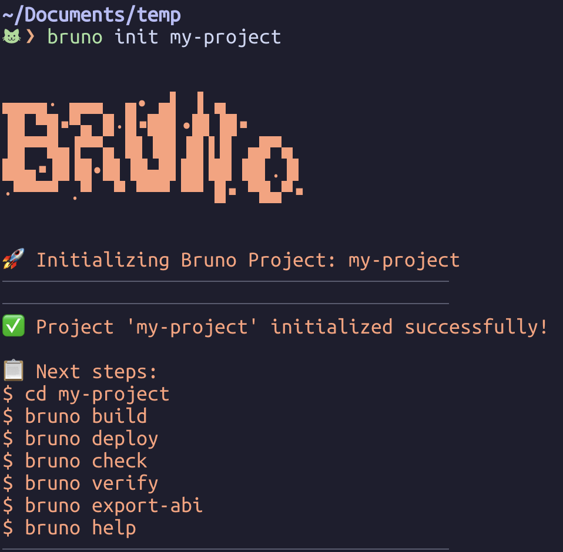

# Bruno CLI

<div align="center">
  
</div>

A command-line tool for generating Rust project scaffolding with a predefined structure.

<div align="center">
  
</div>


## Installation

```bash
cargo install --git https://github.com/AthenaFoss/Bruno --force
```

## Build your CLI tool

```bash
cargo build --release
```

## Install your CLI tool globally

```bash
cargo install --path .
```

## After installation, you'll be able to run:

```bash
bruno init my-project
```

And it will create a new Rust project with:

A basic project structure (models, controllers, views, utils)
Pre-configured Cargo.toml with common dependencies
Sample module files and a main.rs file
Basic configuration files (README.md, .gitignore, bruno.json)

